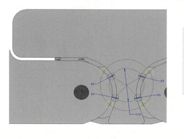
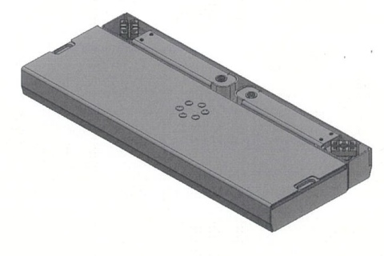

# NNZ-Develop

## 概要

アルネオマイナーチェンジ（NZR（仮））の開発検討・設計・評価・情報共有を行うためのリポジトリです。

本リポジトリでは、開発に関する資料、検討内容、図面、評価結果、課題、進捗などを一元管理し、開発メンバー間で情報を共有します。

## 開発案件

- 開発案件名：アルネオマイナーチェンジ NZR（仮）
- 開発コード：NZR
- 対象製品：アルネオシリーズ
- 開発目的：現行機種のスペックアップおよび車両適用範囲の拡大

## 開発の主なポイント

### 1. スペックアップ

- 現行受台からアヴェンタス、ファンタス受台仕様を取り入れてスペックアップ
- 能力アップ　スイングアームタイプ 能力 3t⇒3.2t  2ウェイタイプ 能力 3.2t⇒3.5t
- バンザイタンデム対抗としてリフト能力3.5tにUP
- 本体の仕様変更を含め、次期フルモデルチェンジも考慮して検討

### 2. 車両整備対象の拡大

車両の変化に対応し、整備対象となる車両の範囲を拡大します。

対象として、アヴェンタス、ファンタス等を想定しています。

### 3. 受台仕様

スイングアームタイプ、2ウェイタイプを中心に仕様を検討します。

- スイングアームタイプ
  - 能力：3.2t
  - 対象仕様：ASC32U等からの仕様移植を検討
  
- 2ウェイタイプ
  - 能力：3.5t
  - 対象仕様：BSC35KUVL等からの仕様移植を検討
  - スライド高さ・目一杯伸長機能を盛り込む方向で検討

#### 受台イメージ

**スイングアームタイプ**

**2ウェイタイプ**

#### 企画仕様と強度検討

- 企画仕様は、スイングアームが3.2t・芯間2,250mm、2ウェイが3.5t・芯間1,400mm。2ウェイはスライド最大2,200mm以上を目指す。
- 強度計算では、3.5t・芯間2,400mmの試算でラム曲げ安全率3.15、溶接部は2.75。溶接部で安全率3を下回る条件がある。　芯間2250mmならなんとか安全率3確保
- シリンダ座屈は両端ピン支持条件でNG、両端固定支持条件ではOKとなる試算。　実際の支持・偏心・たわみを含む条件の確認と実機検証が必要。

資料：[新商品企画書](doc/新商品企画書.pdf) ／ [NNZ検討結果（強度計算）](doc/NNZ検討結果.pdf)

※詳細仕様・寸法・構造については、今後の設計検討結果により更新します。

## 開発イメージ

受台部分の仕様変更・拡大を行い、現行製品では対応できない車両への適用範囲を広げます。

具体的な商品イメージについては、新商品企画書を基準として検討します。

## 販売・商品計画

新商品企画書では、以下の製品構成・販売計画が示されています。

- NZR32WPU(アヴェンタス3.2t受台)
-　NZR35KUVL(ファンタス3.5t受台)
- 年間目標販売台数：300台／年間（4tは除く）

販売価格、発売時期、型式等については、企画内容および今後の検討結果をもとに更新します。

出荷実績の年次推移と主要機種の傾向は、[NNZ出荷実績の傾向分析](doc/NNZ出荷実績分析.md)を参照してください。2017年の1,218台をピークに、2025年は547台まで減少しています。

## リポジトリの運用

### 基本方針

- 開発に関する情報をできるだけリポジトリに集約する
- 検討途中の内容も、後から経緯が分かるように記録する
- 設計変更や判断理由を残す
- メンバー間で共有すべき技術情報を蓄積する
- AIやGitHubを活用し、過去の検討内容・ノウハウを再利用できる状態にする

## 注意事項

本READMEの内容は、開発検討の進捗に応じて更新します。

仕様・寸法・能力・価格・発売時期等については、正式承認された最新資料を優先してください。
